# Linea Jewelry — Design System & Website Specification

> **Project:** Linea Jewelry  
> **Website reference:** https://linea-jewelry.lovable.app/  
> **Purpose of this document:** A complete `design.md` for recreating, extending, or rebuilding the Linea Jewelry website with a consistent luxury e-commerce design system.

---

## 1. Source & Accuracy Notes

The live site reference presents Linea as a minimalist jewelry brand with the tagline:

> “Minimalist jewelry crafted for the modern individual.”

The available research confirmed a clean jewelry storefront structure with a neutral, product-focused layout, shop categories, support pages, social links, and newsletter/community elements. Exact CSS values such as font files, color hex codes, spacing, breakpoints, and component dimensions were not fully accessible, so this file converts the observed direction into a **build-ready recommended design system**.

Use this document as the master design guide. When source CSS becomes available, replace the recommended values with exact measured values.

---

## 2. Brand Summary

### Brand Name
**Linea Jewelry**

### Brand Positioning
Linea is a quiet-luxury jewelry brand focused on minimalist pieces for modern individuals. The website should feel refined, calm, elegant, intentional, and uncluttered.

### Brand Keywords
- Minimal
- Modern
- Elegant
- Timeless
- Soft luxury
- Clean
- Refined
- Feminine but not overly decorative
- Premium but approachable
- Product-first
- Calm confidence

### Visual Personality
The website should not feel loud, overly colorful, or trend-heavy. The design should create a gallery-like experience where jewelry images, typography, and whitespace carry the brand.

### Emotional Feel
Users should feel that the products are:
- Carefully crafted
- Easy to wear daily
- Premium but not intimidating
- Personal and expressive
- Simple enough for everyday use, beautiful enough for special moments

---

## 3. Design Principles

### 3.1 Product First
Product photography must be the main visual focus. UI elements should support browsing and purchasing without competing for attention.

### 3.2 Quiet Luxury
Use neutral colors, soft borders, controlled spacing, and subtle animation. Avoid excessive gradients, bright colors, heavy shadows, and overly playful effects.

### 3.3 Space Is Part of the Design
Whitespace should feel deliberate. Sections need generous breathing room, especially around hero text, product grids, editorial blocks, and footer areas.

### 3.4 Fewer, Better Elements
Every component should feel useful. Do not add decorative UI unless it improves trust, clarity, or product desirability.

### 3.5 Mobile Commerce Matters
Mobile design must be polished. Product cards, cart interactions, filters, quantity selectors, and checkout CTAs should be easy to tap and read.

---

## 4. Sitemap

```mermaid
flowchart TD
    A[Home] --> B[Shop]
    A --> C[Product Detail]
    A --> D[Support]
    A --> E[Cart]
    A --> F[Newsletter]
    A --> G[Social Links]

    B --> B1[New In]
    B --> B2[Rings]
    B --> B3[Earrings]
    B --> B4[Bracelets]
    B --> B5[Necklaces]
    B --> B6[All Jewelry]

    C --> C1[Product Images]
    C --> C2[Product Name]
    C --> C3[Price]
    C --> C4[Material / Description]
    C --> C5[Size / Variant Selection]
    C --> C6[Add to Cart]
    C --> C7[Care Details]
    C --> C8[Shipping & Returns]

    D --> D1[Size Guide]
    D --> D2[Care & Maintenance]
    D --> D3[Returns & Shipping]
    D --> D4[Contact Us]
    D --> D5[FAQ]

    G --> G1[Instagram]
    G --> G2[Pinterest]
```



---

## 5. Page Structure

## 5.1 Home Page

### Purpose
Introduce the brand, direct users to shop, and showcase products quickly.

### Recommended Sections
1. Announcement bar
2. Header / navigation
3. Hero section
4. Featured categories
5. Featured products / best sellers
6. Editorial brand story block
7. Product care or craftsmanship highlight
8. Newsletter signup
9. Footer

### Home Page Hierarchy
1. Brand name / logo
2. Hero headline
3. Primary CTA
4. Product category navigation
5. Featured product cards
6. Trust / care / shipping information
7. Newsletter / social follow

---

## 5.2 Shop Page

### Purpose
Allow customers to browse products by category and quickly compare items.

### Required Elements
- Page title
- Category tabs or filter list
- Product grid
- Sort dropdown
- Optional filters
- Product count
- Empty state
- Loading skeletons

### Suggested Shop Categories
- New In
- Rings
- Earrings
- Bracelets
- Necklaces
- All Jewelry

---

## 5.3 Product Detail Page

### Purpose
Convert interest into purchase by showing clear product details, beautiful imagery, and low-friction add-to-cart actions.

### Required Elements
- Product image gallery
- Product title
- Price
- Short description
- Material / finish details
- Size or variant selector
- Quantity selector
- Add to Cart button
- Secondary action: Add to Wishlist or Save
- Accordion sections:
  - Description
  - Materials
  - Care
  - Shipping & Returns
- Recommended products

---

## 5.4 Cart

### Preferred Pattern
Use a cart drawer on desktop and mobile, with an optional full cart page.

### Cart Drawer Elements
- Drawer title: “Your Cart”
- Product thumbnail
- Product name
- Variant / size
- Quantity selector
- Remove button
- Price per item
- Subtotal
- Shipping note
- Checkout button
- Continue shopping link

---

## 5.5 Support Pages

### Pages
- Size Guide
- Care & Maintenance
- Returns & Shipping
- Contact Us
- FAQ

### Style
Support pages should be content-focused and easy to scan. Use narrow reading widths, clear headings, subtle dividers, and accordion components for FAQs.

---

## 6. Color System

The brand direction is minimalist and neutral. Use warm whites, soft stone tones, dark charcoal, and subtle champagne-gold accents.

## 6.1 Core Palette

| Token | Hex | Usage |
|---|---:|---|
| `--color-ivory` | `#FFFDF9` | Primary page background |
| `--color-bone` | `#F8F6F2` | Secondary background blocks |
| `--color-sand` | `#EFE6DA` | Soft section background / cards |
| `--color-warm-stone` | `#D8CFC3` | Borders, image backgrounds |
| `--color-ash` | `#E8E1D8` | Light divider lines |
| `--color-taupe` | `#80776F` | Muted text / captions |
| `--color-charcoal` | `#2A2724` | Secondary dark text |
| `--color-ink` | `#171513` | Primary text and black buttons |
| `--color-champagne` | `#C8A875` | Luxury accent |
| `--color-antique-gold` | `#A77A45` | Accent hover / premium details |
| `--color-white` | `#FFFFFF` | Cards and clean backgrounds |
| `--color-black` | `#000000` | Maximum contrast only |

## 6.2 Functional Palette

| Token | Hex | Usage |
|---|---:|---|
| `--color-success` | `#027A48` | Success messages |
| `--color-success-bg` | `#ECFDF3` | Success background |
| `--color-warning` | `#B54708` | Stock warnings / notices |
| `--color-warning-bg` | `#FFFAEB` | Warning background |
| `--color-error` | `#B42318` | Form errors / failed payment |
| `--color-error-bg` | `#FEF3F2` | Error background |
| `--color-focus` | `#A77A45` | Focus ring |

## 6.3 Color Usage Rules

### Backgrounds
- Main background should be `--color-ivory` or `--color-white`.
- Use `--color-bone` for soft section contrast.
- Avoid pure grey backgrounds unless they are very warm.

### Text
- Primary text: `--color-ink`
- Secondary text: `--color-taupe`
- Footer text: `--color-charcoal`
- Disabled text: `#AAA39B`

### Buttons
- Primary button: dark fill with light text.
- Secondary button: transparent or white with dark border.
- Accent button may use champagne/gold sparingly.

### Borders
- Use subtle borders: `--color-ash` or `--color-warm-stone`.
- Avoid heavy black borders except for active states or high-emphasis controls.

### Accent Usage
Use gold/champagne for:
- Small dividers
- Active filter state
- Text highlights
- Premium badges
- Focus ring
- Very subtle hover states

Do not use gold as a large background unless the section is intentionally premium and contrast is tested.

---

## 7. Typography System

The observed design direction is clean and modern. Use a sans-serif-first system for a minimal storefront. A restrained editorial serif may be used for luxury headings if desired.

## 7.1 Recommended Font Families

### Primary Sans Font
```css
font-family: "Inter", "Helvetica Neue", Arial, sans-serif;
```

### Optional Editorial Display Font
```css
font-family: "Cormorant Garamond", Georgia, serif;
```

### Default Recommendation
Use **Inter** for most UI and content. Use the optional serif only for large hero/editorial moments if you want a more boutique luxury feel.

---

## 7.2 Type Scale

| Style | Desktop | Tablet | Mobile | Weight | Line Height | Letter Spacing | Usage |
|---|---:|---:|---:|---:|---:|---:|---|
| Display XL | 72px | 56px | 42px | 400–500 | 0.94 | `-0.055em` | Large hero heading |
| Display L | 56px | 44px | 34px | 400–500 | 1.00 | `-0.045em` | Home hero / editorial heading |
| H1 | 48px | 40px | 32px | 500 | 1.05 | `-0.04em` | Main page title |
| H2 | 36px | 32px | 26px | 500 | 1.12 | `-0.035em` | Section headings |
| H3 | 28px | 24px | 22px | 500 | 1.18 | `-0.025em` | Product sections |
| H4 | 22px | 21px | 20px | 500 | 1.25 | `-0.015em` | Card titles / accordions |
| Body L | 18px | 17px | 16px | 400 | 1.65 | `-0.01em` | Hero paragraph / intro text |
| Body | 16px | 16px | 15px | 400 | 1.6 | `-0.005em` | Standard paragraphs |
| Body S | 14px | 14px | 13px | 400 | 1.55 | `0em` | Product metadata / support copy |
| Caption | 12px | 12px | 12px | 500 | 1.45 | `0.04em` | Labels, badges, helper text |
| Button | 14px | 14px | 14px | 600 | 1.2 | `0.045em` | Button text |
| Nav | 13px | 13px | 14px | 500 | 1.2 | `0.075em` | Navigation links |
| Logo | 24px | 23px | 22px | 500 | 1 | `0.16em` | Brand wordmark |

---

## 7.3 Typography Rules

### Headings
- Keep headings short and elegant.
- Use tight letter spacing for large headings.
- Avoid all-caps for large headings except small labels.
- Do not use more than two heading styles in one section.

### Body Copy
- Body text should be calm and readable.
- Keep paragraph width between `54ch` and `68ch`.
- Avoid long blocks of text on product and shop pages.

### Navigation Text
- Use uppercase or small caps style sparingly.
- Letter spacing should be slightly expanded.
- Nav should feel refined, not loud.

### Product Text
- Product names should be simple and clear.
- Prices should use the same type family as product names.
- Product metadata should be smaller and muted.

---

## 8. Spacing System

Use an 8px-based spacing system with additional fine values for borders and micro-adjustments.

## 8.1 Spacing Tokens

| Token | Value | Usage |
|---|---:|---|
| `--space-0` | `0px` | No spacing |
| `--space-1` | `4px` | Micro spacing |
| `--space-2` | `8px` | Small gaps |
| `--space-3` | `12px` | Form helper spacing |
| `--space-4` | `16px` | Base padding / mobile card padding |
| `--space-5` | `20px` | Medium-small spacing |
| `--space-6` | `24px` | Standard component spacing |
| `--space-8` | `32px` | Section inner spacing |
| `--space-10` | `40px` | Larger gaps |
| `--space-12` | `48px` | Section spacing |
| `--space-16` | `64px` | Desktop section padding |
| `--space-20` | `80px` | Large vertical section padding |
| `--space-24` | `96px` | Hero / feature spacing |
| `--space-30` | `120px` | Large luxury whitespace |
| `--space-36` | `144px` | Maximum desktop spacing |

---

## 8.2 Section Padding

| Section | Desktop | Tablet | Mobile |
|---|---:|---:|---:|
| Announcement bar | `8px 24px` | `8px 20px` | `8px 16px` |
| Header | `0 48px` | `0 32px` | `0 20px` |
| Hero | `112px 48px 96px` | `88px 32px 72px` | `64px 20px 56px` |
| Product grid section | `80px 48px` | `64px 32px` | `48px 20px` |
| Editorial section | `96px 48px` | `72px 32px` | `56px 20px` |
| Newsletter section | `80px 48px` | `64px 32px` | `48px 20px` |
| Footer | `64px 48px 32px` | `56px 32px 28px` | `48px 20px 24px` |

---

## 8.3 Margin Rules

### Page-Level Margins
- Body margin: `0`
- Main container centered with auto margins.
- Use container padding instead of page-level margins.

### Heading Margins
```css
h1, h2, h3, h4 {
  margin-top: 0;
}

h1 { margin-bottom: 24px; }
h2 { margin-bottom: 20px; }
h3 { margin-bottom: 16px; }
p  { margin-top: 0; margin-bottom: 16px; }
```

### Section Spacing
- Space between major sections: `64px–96px` desktop.
- Space between section heading and content: `32px–48px` desktop.
- Space between product cards: `24px–32px` desktop.
- Space inside product cards: `12px–16px`.

---

## 9. Layout System

## 9.1 Containers

| Container | Max Width | Padding Desktop | Padding Tablet | Padding Mobile | Usage |
|---|---:|---:|---:|---:|---|
| `container-page` | `1440px` | `48px` | `32px` | `20px` | Full page sections |
| `container-wide` | `1320px` | `48px` | `32px` | `20px` | Product grids |
| `container-content` | `1080px` | `40px` | `32px` | `20px` | Editorial content |
| `container-narrow` | `760px` | `32px` | `28px` | `20px` | Support pages / forms |
| `container-product` | `1200px` | `48px` | `32px` | `20px` | Product detail pages |

```css
.container-wide {
  width: 100%;
  max-width: 1320px;
  margin-inline: auto;
  padding-inline: 48px;
}

@media (max-width: 1024px) {
  .container-wide { padding-inline: 32px; }
}

@media (max-width: 640px) {
  .container-wide { padding-inline: 20px; }
}
```

---

## 9.2 Grid System

### Desktop
- 12-column grid
- Column gap: `24px–32px`
- Product grid: 4 columns
- Editorial split: 2 columns

### Tablet
- 8-column grid
- Column gap: `24px`
- Product grid: 3 columns
- Editorial split can remain 2 columns if content fits

### Mobile
- 4-column grid
- Column gap: `16px`
- Product grid: 1–2 columns depending on screen width
- Editorial content stacks vertically

---

## 9.3 Breakpoints

| Token | Width | Usage |
|---|---:|---|
| `--bp-xs` | `360px` | Small phones |
| `--bp-sm` | `480px` | Large phones |
| `--bp-md` | `768px` | Tablets |
| `--bp-lg` | `1024px` | Small laptops |
| `--bp-xl` | `1280px` | Desktop |
| `--bp-2xl` | `1440px` | Large desktop |

Recommended media queries:

```css
@media (max-width: 767px) { /* mobile */ }
@media (min-width: 768px) and (max-width: 1023px) { /* tablet */ }
@media (min-width: 1024px) { /* desktop */ }
@media (min-width: 1440px) { /* large desktop */ }
```

---

## 10. Border Radius System

The site should use subtle radius. Avoid bubbly, overly playful rounded corners.

| Token | Value | Usage |
|---|---:|---|
| `--radius-none` | `0px` | Editorial images / sharp luxury blocks |
| `--radius-xs` | `2px` | Thin badges / small controls |
| `--radius-sm` | `4px` | Inputs, compact buttons |
| `--radius-md` | `8px` | Cards, dropdowns, product info panels |
| `--radius-lg` | `12px` | Product cards, modals |
| `--radius-xl` | `16px` | Large editorial cards |
| `--radius-2xl` | `24px` | Premium panels / newsletter block |
| `--radius-pill` | `999px` | Pills, badges, quantity controls |

### Radius Rules
- Product images: `12px` or `0px` depending on desired editorial sharpness.
- Buttons: `4px` for modern minimal, `999px` for softer premium feel.
- Inputs: `4px–8px`.
- Cards: `8px–16px`.
- Cart drawer / modal: `16px`.

---

## 11. Shadows & Elevation

Shadows must be extremely subtle.

| Token | Value | Usage |
|---|---|---|
| `--shadow-none` | `none` | Default |
| `--shadow-soft` | `0 8px 24px rgba(23, 21, 19, 0.06)` | Dropdowns / cards on hover |
| `--shadow-modal` | `0 24px 80px rgba(23, 21, 19, 0.18)` | Modal / cart drawer |
| `--shadow-focus` | `0 0 0 3px rgba(167, 122, 69, 0.24)` | Focus state |

### Shadow Rules
- Do not use heavy ecommerce drop shadows.
- Product cards should mostly rely on spacing and imagery, not shadows.
- Use shadow on hover only if it feels soft and premium.

---

## 12. Component System

---

# 12.1 Announcement Bar

### Purpose
Communicate shipping, launch, sale, or newsletter information.

### Layout
- Height: `36px–40px`
- Padding: `8px 24px`
- Text aligned center
- Background: `--color-ink`
- Text: `--color-ivory`
- Font size: `12px`
- Letter spacing: `0.04em`

### Example Copy
- “Free shipping on orders over R750”
- “New minimalist pieces now available”
- “Join the newsletter for early access”

---

# 12.2 Header / Navigation

### Desktop Header
- Height: `72px`
- Padding: `0 48px`
- Display: flex
- Alignment: center
- Position: sticky optional
- Background: `rgba(255, 253, 249, 0.88)`
- Backdrop blur: `12px` if sticky
- Border bottom: `1px solid rgba(216, 207, 195, 0.55)`

### Mobile Header
- Height: `64px`
- Padding: `0 20px`
- Left: menu icon
- Center or left: logo
- Right: cart icon

### Header Structure
```text
[Logo]     [Shop] [New In] [Rings] [Earrings] [Support]      [Search] [Cart]
```

### Navigation Link Style
```css
.nav-link {
  font-size: 13px;
  font-weight: 500;
  letter-spacing: 0.075em;
  text-transform: uppercase;
  color: var(--color-ink);
  padding: 8px 10px;
}
```

### Hover State
- Text color: `--color-antique-gold`
- Optional underline: 1px line below text
- Transition: `180ms ease`

### Active State
- Text color: `--color-antique-gold`
- Underline or small dot indicator

---

# 12.3 Logo / Wordmark

### Style
- Text-based logo preferred
- Minimal, spaced, refined
- Do not add unnecessary icon marks unless the brand has one

```css
.logo {
  font-size: 24px;
  font-weight: 500;
  letter-spacing: 0.16em;
  text-transform: uppercase;
  color: var(--color-ink);
}
```

### Mobile
```css
.logo {
  font-size: 21px;
  letter-spacing: 0.14em;
}
```

---

# 12.4 Hero Section

### Purpose
Immediately communicate brand mood and move users to shopping.

### Layout Options

#### Option A — Split Hero
- Left: copy and CTA
- Right: product/lifestyle image
- Best for premium ecommerce

#### Option B — Full-Image Hero
- Background image with text overlay
- Use only if photography is strong and contrast is safe

#### Option C — Centered Minimal Hero
- Text centered with product image below
- Best for minimalist luxury

### Recommended Hero Layout
Use a split hero on desktop and stacked layout on mobile.

### Desktop Hero Measurements
- Section padding: `112px 48px 96px`
- Max width: `1320px`
- Grid: 2 columns
- Column gap: `64px`
- Text width: max `560px`
- Image height: `620px`

### Mobile Hero Measurements
- Padding: `64px 20px 56px`
- Stack text above image
- Image height: `420px`

### Hero Typography
- Eyebrow: Caption style, uppercase, `0.12em` letter spacing
- Heading: Display L or H1
- Body: Body L
- CTA: Primary button

### Example Hero Copy
```text
Minimalist jewelry crafted for the modern individual.

Timeless pieces made to move with you — simple, refined, and designed for everyday elegance.
```

### Hero Image Rules
- Use soft natural lighting
- Neutral background
- Jewelry should be visible and sharp
- Avoid cluttered styling
- Prefer hands, neck, ears, and close-up product compositions

---

# 12.5 Buttons

## Primary Button

### Usage
Main CTA actions:
- Shop Now
- Add to Cart
- Checkout
- Subscribe

```css
.button-primary {
  display: inline-flex;
  align-items: center;
  justify-content: center;
  min-height: 48px;
  padding: 14px 28px;
  border-radius: 4px;
  border: 1px solid var(--color-ink);
  background: var(--color-ink);
  color: var(--color-ivory);
  font-size: 14px;
  font-weight: 600;
  letter-spacing: 0.045em;
  text-transform: uppercase;
  transition: background 180ms ease, color 180ms ease, transform 180ms ease;
}
```

### Hover
```css
.button-primary:hover {
  background: var(--color-antique-gold);
  border-color: var(--color-antique-gold);
  transform: translateY(-1px);
}
```

### Active
```css
.button-primary:active {
  transform: translateY(0);
}
```

### Disabled
```css
.button-primary:disabled {
  background: #CFC8BE;
  border-color: #CFC8BE;
  color: #F8F6F2;
  cursor: not-allowed;
}
```

---

## Secondary Button

```css
.button-secondary {
  min-height: 48px;
  padding: 14px 28px;
  border-radius: 4px;
  border: 1px solid var(--color-warm-stone);
  background: transparent;
  color: var(--color-ink);
  font-size: 14px;
  font-weight: 600;
  letter-spacing: 0.045em;
  text-transform: uppercase;
}
```

### Hover
- Border color: `--color-ink`
- Background: `--color-bone`

---

## Text Button

Use for lower-priority actions:
- Continue Shopping
- View Details
- Read More

```css
.button-text {
  background: transparent;
  border: 0;
  color: var(--color-ink);
  font-size: 14px;
  font-weight: 500;
  letter-spacing: 0.02em;
  text-decoration: underline;
  text-underline-offset: 4px;
}
```

---

# 12.6 Product Cards

### Purpose
Show products clearly and consistently in grids.

### Desktop Card
- Image aspect ratio: `1 / 1.18` or `1 / 1`
- Border radius: `12px`
- Image background: `--color-bone`
- Text padding top: `14px`
- Gap between title and price: `6px`

### Product Card Structure
```text
[Product Image]
[Product Name]        [Price]
[Material / Category]
```

### CSS Recommendation
```css
.product-card {
  display: flex;
  flex-direction: column;
  gap: 14px;
}

.product-card__image-wrap {
  position: relative;
  overflow: hidden;
  border-radius: 12px;
  background: var(--color-bone);
  aspect-ratio: 1 / 1.15;
}

.product-card img {
  width: 100%;
  height: 100%;
  object-fit: cover;
  transition: transform 420ms cubic-bezier(.22, 1, .36, 1);
}

.product-card:hover img {
  transform: scale(1.035);
}
```

### Product Card Typography
- Product name: `15px`, weight `500`, letter spacing `-0.005em`
- Price: `14px`, weight `500`
- Metadata: `12px`, muted text

### Hover Interaction
- Image gently scales up
- Quick view or Add to Cart may fade in
- No harsh shadow

### Product Grid Rules
| Viewport | Columns | Gap |
|---|---:|---:|
| Small mobile `<390px` | 1 | `20px` |
| Mobile `390px–767px` | 2 | `16px` |
| Tablet `768px–1023px` | 3 | `24px` |
| Desktop `1024px+` | 4 | `28px–32px` |

---

# 12.7 Category Cards

### Usage
Home page category section.

### Categories
- Rings
- Earrings
- Bracelets
- Necklaces

### Layout
- 4 cards desktop
- 2x2 tablet
- Stacked or 2 columns mobile

### Card Style
- Large image
- Text overlay bottom-left or below image
- Subtle gradient overlay only if text overlays image
- Border radius: `12px–16px`

---

# 12.8 Forms & Inputs

### Input Style
```css
.input {
  width: 100%;
  min-height: 48px;
  padding: 12px 14px;
  border: 1px solid var(--color-warm-stone);
  border-radius: 4px;
  background: var(--color-white);
  color: var(--color-ink);
  font-size: 15px;
  line-height: 1.4;
}
```

### Placeholder
```css
.input::placeholder {
  color: #9A928A;
}
```

### Focus
```css
.input:focus {
  outline: none;
  border-color: var(--color-antique-gold);
  box-shadow: var(--shadow-focus);
}
```

### Error
```css
.input[aria-invalid="true"] {
  border-color: var(--color-error);
}
```

### Label Style
- Font size: `13px`
- Weight: `500`
- Letter spacing: `0.025em`
- Margin bottom: `8px`

### Form Field Spacing
- Label to input: `8px`
- Input to helper text: `6px`
- Field to field: `20px`
- Form section gap: `32px`

---

# 12.9 Newsletter Block

### Purpose
Capture email leads with a premium, calm feel.

### Layout
- Background: `--color-bone` or `--color-sand`
- Border radius: `24px`
- Padding desktop: `64px`
- Padding mobile: `32px 20px`
- Center aligned or split with short copy

### Required Elements
- Heading
- Short value proposition
- Email input
- Subscribe button
- Privacy note

### Example Copy
```text
Join the Linea list
Receive new collection notes, care tips, and early access to limited pieces.
```

---

# 12.10 Footer

### Desktop Layout
- 4 columns
  1. Brand / short tagline
  2. Shop
  3. Support
  4. Connect / Newsletter

### Mobile Layout
- Stack columns vertically
- Use accordion optional for link groups

### Footer Measurements
- Padding top: `64px`
- Padding bottom: `32px`
- Column gap: `48px`
- Border top: `1px solid var(--color-ash)`

### Footer Typography
- Column heading: `12px`, uppercase, `0.1em` letter spacing
- Links: `14px`, line-height `1.8`
- Legal text: `12px`, muted

### Footer Links
Shop:
- New In
- Rings
- Earrings
- Bracelets
- Necklaces

Support:
- Size Guide
- Care & Maintenance
- Returns & Shipping
- Contact Us

Connect:
- Instagram
- Pinterest
- Newsletter

Legal:
- Privacy Policy
- Terms of Service

---

# 12.11 Cart Drawer

### Dimensions
- Desktop width: `420px–480px`
- Mobile width: `100vw`
- Height: `100vh`
- Background: `--color-ivory`
- Shadow: `--shadow-modal`

### Layout
```text
[Header: Your Cart] [Close]
[Cart Items]
[Subtotal]
[Shipping note]
[Checkout Button]
[Continue Shopping]
```

### Cart Item
- Image: `88px x 104px`
- Gap: `16px`
- Product title: `14px–15px`
- Variant: `12px`, muted
- Quantity control: pill or square control

### Overlay
```css
.cart-overlay {
  background: rgba(23, 21, 19, 0.32);
  backdrop-filter: blur(2px);
}
```

---

# 12.12 Accordions

Use accordions for product details, FAQ, support pages.

### Style
- Border bottom: `1px solid var(--color-ash)`
- Header padding: `18px 0`
- Body padding: `0 0 20px`
- Icon: plus/minus or chevron

### Interaction
- Chevron rotates `180deg`
- Content expands smoothly
- Duration: `220ms`

---

# 12.13 Badges

### Usage
- New
- Low Stock
- Sold Out
- Best Seller

### Style
```css
.badge {
  display: inline-flex;
  align-items: center;
  min-height: 24px;
  padding: 4px 9px;
  border-radius: 999px;
  background: var(--color-bone);
  color: var(--color-ink);
  font-size: 11px;
  font-weight: 600;
  letter-spacing: 0.08em;
  text-transform: uppercase;
}
```

---

## 13. Imagery Direction

## 13.1 Product Photography

### Style
- Clean background
- Soft shadows
- Warm natural lighting
- Close-up detail shots
- Minimal props
- Neutral tones
- Product clearly visible

### Avoid
- Harsh studio flash
- Overcrowded product scenes
- Neon colors
- Busy textures
- Low-resolution images
- Images with inconsistent backgrounds

### Image Ratios
| Image Type | Ratio | Usage |
|---|---:|---|
| Product card | `1 / 1.15` or `1 / 1` | Shop grids |
| Product detail main | `4 / 5` | Large gallery image |
| Hero image | `4 / 5`, `16 / 10`, or full bleed | Home hero |
| Category card | `3 / 4` | Home category links |
| Editorial image | `4 / 5` or `3 / 2` | Brand story |

### Technical Requirements
- Use WebP where possible
- Provide fallback JPEG/PNG
- Use lazy loading below the fold
- Use `object-fit: cover`
- Use responsive image sizes
- Always add alt text

### Alt Text Examples
- “Minimal gold ring on a neutral stone surface”
- “Model wearing minimalist hoop earrings”
- “Stacked gold bracelets styled on wrist”

---

## 14. Iconography

### Style
- Thin-line icons
- Rounded stroke caps optional
- Stroke width: `1.5px–2px`
- Size: `20px–24px`
- Monochrome

### Required Icons
- Menu
- Close
- Cart / shopping bag
- Search
- User optional
- Chevron down
- Plus / minus
- Instagram
- Pinterest
- Email

### Icon Rules
- Icons should never overpower text.
- Maintain consistent stroke width.
- Cart icon should include item count badge.
- Social icons should use the same color as footer text.

---

## 15. Motion & Interaction

Motion should feel soft, smooth, and premium.

## 15.1 Motion Tokens

| Token | Value | Usage |
|---|---:|---|
| `--duration-fast` | `120ms` | Small hover effects |
| `--duration-base` | `180ms` | Buttons, links |
| `--duration-medium` | `240ms` | Dropdowns, accordions |
| `--duration-slow` | `420ms` | Product image zoom / hero reveal |
| `--ease-out` | `cubic-bezier(.22, 1, .36, 1)` | Smooth premium exit |
| `--ease-standard` | `cubic-bezier(.2, 0, 0, 1)` | General transitions |

## 15.2 Animation Rules

### Buttons
- Hover: translate up `-1px`
- Active: return to `0`
- Duration: `180ms`

### Product Images
- Hover: scale to `1.035`
- Duration: `420ms`
- Easing: `--ease-out`

### Dropdown Menus
- Fade in + move down `4px`
- Duration: `180ms–220ms`

### Cart Drawer
- Slide from right
- Duration: `280ms`
- Easing: `--ease-out`

### Page Section Reveal
Optional:
- Opacity `0 → 1`
- Translate Y `12px → 0`
- Duration: `500ms`
- Use once per section, not every tiny element

### Reduced Motion
Respect user preference:
```css
@media (prefers-reduced-motion: reduce) {
  * {
    animation-duration: 0.01ms !important;
    animation-iteration-count: 1 !important;
    scroll-behavior: auto !important;
    transition-duration: 0.01ms !important;
  }
}
```

---

## 16. UI States

## 16.1 Links

### Default
- Color: `--color-ink`
- No underline or subtle underline depending on context

### Hover
- Color: `--color-antique-gold`
- Underline with `text-underline-offset: 4px`

### Focus
- Visible outline or focus ring

---

## 16.2 Buttons

| State | Visual Treatment |
|---|---|
| Default | Clear fill/border, strong contrast |
| Hover | Slight color change, subtle lift |
| Active | Pressed state, no lift |
| Focus | Gold focus ring, visible keyboard state |
| Disabled | Muted color, no hover, cursor not allowed |
| Loading | Spinner or text “Adding…” |

---

## 16.3 Product Card

| State | Visual Treatment |
|---|---|
| Default | Image + text, clean and calm |
| Hover | Image zoom, optional quick action reveal |
| Focus | Focus outline around card or action |
| Sold Out | Muted image opacity, badge, disabled add-to-cart |
| Loading | Skeleton image block and text lines |

---

## 17. Accessibility Standards

### Contrast
- Body text must meet WCAG AA contrast.
- Gold text on white often fails contrast; test before use.
- Prefer dark text on champagne backgrounds.

### Keyboard Access
- All links, buttons, filters, quantity controls, and cart actions must be keyboard accessible.
- Dropdowns and accordions must work with Enter and Space.

### Focus States
- Do not remove outlines unless replacing with a visible custom focus style.
- Use `--shadow-focus` for premium focus indicators.

### Touch Targets
- Minimum interactive size: `44px x 44px`.
- Mobile cart and menu controls must be easy to tap.

### Forms
- Every input must have a visible label or accessible label.
- Errors must be shown visually and announced to screen readers.
- Do not rely on placeholder text as the only label.

### Images
- Product images need descriptive alt text.
- Decorative images can use empty `alt=""`.

### Motion
- Respect `prefers-reduced-motion`.
- Avoid auto-moving carousels unless they can be paused.

---

## 18. Content & Copy Guidelines

## 18.1 Voice
- Calm
- Precise
- Warm
- Minimal
- Confident
- Not overly salesy

## 18.2 Writing Rules
- Use short, elegant sentences.
- Avoid hype words like “crazy,” “insane,” “must-have” unless intentionally campaign-driven.
- Mention craftsmanship, material, fit, care, and everyday wear.
- Product descriptions should feel premium but simple.

## 18.3 Example Copy

### Hero
```text
Minimalist jewelry crafted for the modern individual.
```

### Supporting Line
```text
Refined everyday pieces designed to feel effortless, personal, and timeless.
```

### Category CTA
```text
Discover Rings
```

### Product Detail
```text
A delicate everyday piece with a clean silhouette and polished finish. Designed to be worn alone or layered with your favourite essentials.
```

### Newsletter
```text
Join the Linea list for new collection notes, styling inspiration, and early access to limited pieces.
```

---

## 19. Ecommerce UX Rules

### Product Browsing
- Keep category switching simple.
- Show product names and prices clearly.
- Do not hide price behind hover.
- Product cards must be tappable on mobile.

### Add to Cart
- Provide immediate feedback after adding item.
- Open cart drawer or show toast confirmation.
- Update cart count instantly.

### Product Detail
- Keep Add to Cart visible above the fold on desktop.
- On mobile, consider sticky bottom Add to Cart button.
- Show shipping/returns reassurance near purchase CTA.

### Empty Cart
Include:
- Friendly message
- Continue shopping button
- Suggested categories

### Error States
- Out of stock: clearly disable purchase.
- Failed add to cart: show plain explanation.
- Form error: show field-specific message.

---

## 20. Responsive Specifications

## 20.1 Mobile

### Layout
- Single-column layout for most sections.
- Product grid can be 2 columns on larger phones.
- Header simplified with menu + logo + cart.

### Spacing
- Page padding: `20px`
- Section padding: `48px–64px` vertical
- Grid gap: `16px–20px`

### Typography
- H1: `32px–42px`
- Body: `15px–16px`
- Buttons: full width for primary CTAs where useful

### Mobile UX
- Sticky Add to Cart on product pages recommended.
- Cart drawer full width.
- Filters should open in bottom sheet or drawer.

---

## 20.2 Tablet

### Layout
- Product grid: 3 columns
- Editorial: 2 columns if enough space, otherwise stacked
- Header can still show desktop nav depending on width

### Spacing
- Page padding: `32px`
- Section padding: `64px–72px`

---

## 20.3 Desktop

### Layout
- Product grid: 4 columns
- Hero split layout
- Header full navigation
- Footer 4 columns

### Spacing
- Page padding: `48px`
- Section padding: `80px–112px`
- Grid gap: `28px–32px`

---

## 21. Specific Page Layout Specs

## 21.1 Home Layout

```text
Announcement Bar: 36px
Header: 72px
Hero: 2-column, 112px top padding
Featured Categories: 4 cards
Featured Products: 4-column grid
Editorial Story: image + text split
Newsletter: centered panel
Footer: 4 columns
```

### Home Spacing
- Header to hero content: no extra margin if hero follows header.
- Hero to categories: `80px`.
- Categories to products: `80px`.
- Products to editorial: `96px`.
- Editorial to newsletter: `96px`.

---

## 21.2 Shop Layout

```text
Header
Shop title row
Category/filter row
Product grid
Pagination or Load More
Footer
```

### Shop Header
- Padding top: `64px`
- Padding bottom: `40px`
- H1: `48px desktop`, `32px mobile`

### Filters
- Desktop: horizontal filters or sidebar
- Mobile: drawer/bottom sheet

### Product Grid
- Desktop: 4 columns
- Tablet: 3 columns
- Mobile: 2 columns or 1 column for small screens

---

## 21.3 Product Detail Layout

### Desktop
```text
[Image Gallery 58%] [Product Info 42%]
```

### Image Gallery
- Main image large
- Secondary thumbnails in grid or carousel
- Gap: `16px`

### Product Info
- Sticky top optional
- Max width: `440px`
- Gap between sections: `24px`

### Mobile
```text
[Image carousel]
[Product Info]
[Sticky Add to Cart optional]
[Accordions]
[Recommended Products]
```

---

## 21.4 Support Page Layout

### Layout
- Narrow container: `760px`
- Top padding: `72px`
- Bottom padding: `96px`
- H1 followed by intro paragraph
- Content broken into clear sections

### Support Typography
- H1: `40px–48px`
- Section H2: `24px–28px`
- Body: `16px`
- Table text: `14px–15px`

---

## 22. Design Tokens CSS

```css
:root {
  /* Colors */
  --color-ivory: #FFFDF9;
  --color-bone: #F8F6F2;
  --color-sand: #EFE6DA;
  --color-warm-stone: #D8CFC3;
  --color-ash: #E8E1D8;
  --color-taupe: #80776F;
  --color-charcoal: #2A2724;
  --color-ink: #171513;
  --color-champagne: #C8A875;
  --color-antique-gold: #A77A45;
  --color-white: #FFFFFF;
  --color-black: #000000;
  --color-success: #027A48;
  --color-success-bg: #ECFDF3;
  --color-warning: #B54708;
  --color-warning-bg: #FFFAEB;
  --color-error: #B42318;
  --color-error-bg: #FEF3F2;
  --color-focus: #A77A45;

  /* Fonts */
  --font-sans: "Inter", "Helvetica Neue", Arial, sans-serif;
  --font-display: "Cormorant Garamond", Georgia, serif;

  /* Spacing */
  --space-0: 0px;
  --space-1: 4px;
  --space-2: 8px;
  --space-3: 12px;
  --space-4: 16px;
  --space-5: 20px;
  --space-6: 24px;
  --space-8: 32px;
  --space-10: 40px;
  --space-12: 48px;
  --space-16: 64px;
  --space-20: 80px;
  --space-24: 96px;
  --space-30: 120px;
  --space-36: 144px;

  /* Radius */
  --radius-none: 0px;
  --radius-xs: 2px;
  --radius-sm: 4px;
  --radius-md: 8px;
  --radius-lg: 12px;
  --radius-xl: 16px;
  --radius-2xl: 24px;
  --radius-pill: 999px;

  /* Shadows */
  --shadow-none: none;
  --shadow-soft: 0 8px 24px rgba(23, 21, 19, 0.06);
  --shadow-modal: 0 24px 80px rgba(23, 21, 19, 0.18);
  --shadow-focus: 0 0 0 3px rgba(167, 122, 69, 0.24);

  /* Motion */
  --duration-fast: 120ms;
  --duration-base: 180ms;
  --duration-medium: 240ms;
  --duration-slow: 420ms;
  --ease-out: cubic-bezier(.22, 1, .36, 1);
  --ease-standard: cubic-bezier(.2, 0, 0, 1);
}
```

---

## 23. Implementation Checklist

### Global
- [ ] Apply CSS reset / normalize styles.
- [ ] Set body background to `--color-ivory`.
- [ ] Use `--font-sans` globally.
- [ ] Apply consistent container classes.
- [ ] Add accessible focus states.
- [ ] Add reduced motion support.

### Header
- [ ] Desktop nav works.
- [ ] Mobile menu works.
- [ ] Cart count updates.
- [ ] Header is responsive.
- [ ] Sticky header does not cover anchor content.

### Products
- [ ] Product cards have consistent image ratio.
- [ ] Product images lazy load.
- [ ] Product names and prices are visible without hover.
- [ ] Sold-out states are clear.
- [ ] Add-to-cart has loading and success feedback.

### Cart
- [ ] Cart drawer opens/closes smoothly.
- [ ] Keyboard focus is trapped in drawer.
- [ ] Escape closes drawer.
- [ ] Quantity controls work.
- [ ] Subtotal updates instantly.
- [ ] Empty state looks polished.

### Forms
- [ ] Inputs have labels.
- [ ] Error messages are clear.
- [ ] Newsletter form validates email.
- [ ] Contact form has success and error states.

### Responsive
- [ ] Test at 360px, 390px, 480px, 768px, 1024px, 1280px, 1440px.
- [ ] Product grid does not squeeze text.
- [ ] Buttons remain tappable.
- [ ] Images crop correctly.

### Accessibility
- [ ] Contrast passes WCAG AA.
- [ ] All interactive elements have focus styles.
- [ ] Screen reader labels exist for icons.
- [ ] Alt text exists for product images.
- [ ] No motion-only information.

---

## 24. Final Visual Direction Summary

Linea Jewelry should feel like a quiet, premium online boutique. The design should use warm neutral colors, elegant spacing, subtle borders, clean typography, soft image treatments, and controlled motion. Nothing should feel heavy or overdesigned. The strongest visual assets should be the product photos, the whitespace, and the refined typography.

The result should communicate:

```text
Minimal jewelry.
Modern elegance.
Effortless everyday luxury.
```

